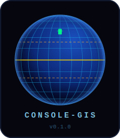

<div align="center">


# console-gis

**A geographic information system for the terminal.**

*From WGS-84 coordinates to Unicode half-block pixels — a complete GIS projection pipeline in Rust.*

[](#building)
[](https://www.rust-lang.org)
[](#terminal-capability-tiers)
[](#license)

</div>

---

console-gis is a first-of-its-kind GIS library that brings geographic information system
capabilities to the raw terminal — from DEC VT-100 hardware over a serial line up to modern
24-bit true-colour terminals.  It implements a complete projection pipeline: WGS-84 geographic
coordinates → Web Mercator metres → Console Pixel Equivalents → Unicode characters, with full
zoom level 0–20 compatibility matching the conventions of web GIS systems (OpenStreetMap, Leaflet,
Google Maps).

```
 CONSOLE-GIS
 ─────────────────────────────────────────────────────────────────────────────
  ·:·:·:·::::::::::°°°°°°°°°°°°°°°°°°°°°°°°°°°°°°°°°°°::::::::::·:·:·:·
 ·::::::::::::::°°°°°°°°°°°°°°°°°°°°°°° ██▀▀▄▄ °°°°°°°°°°°°°°°:::::::::::·
  ::::::::::°°°°°°°°°°°°°°°°°° °██ ▄█████████████ ██ °°°°°°°°°°°°°°::::::::
   ::::::°°°°°°°°°°°°°°°° ██▄████████████████████████████▄██ °°°°°°°°::::
    ::::°°°°°°°°°°°°° █████████████████████████████████████████ °°°°°:::
     ::°°°°°°°°°°°° ████████████████████████████████████████████ °°°°::
      :°°°°°°°°°° █████████████████████████████████████████████ °°°°:
       °°°°°°°° ███████████████████████████████████████████████ °°°°
        °°°°°° ████████████████████████ ██████████████████████  °°°
        °°°°°° ██████████████████████   ███████████████████████ °°°
        °°°°°° █████████████████████      ██████████████████████°°°
         °°°° ████████████████████            █████████████████°°°
          °°° ████████████████████              ████████████████°°
          °°° ████████████████████                 ██████████████°
          °°°  ███████████████████                   █████████████
           °°°  █████████████████                     ████████████
            °°°  ███████████████                       ████████████
             °°°  █████████████                         ████████████
              °°°° ████████████                          ████████████
               °°°° ██████████                           ███████████
                °°°° █████████                           ██████████
 ─────────────────────────────────────────────────────────────────────────────
  C O N S O L E - G I S                                            v0.1.0
```

---

## Table of Contents

- [The Projection Pipeline](#the-projection-pipeline)
  - [WGS-84: The Coordinate Foundation](#1-wgs-84-the-coordinate-foundation)
  - [Web Mercator: The Tile Projection](#2-web-mercator-the-tile-projection)
  - [Zoom Levels: Ground Resolution](#3-zoom-levels-ground-resolution)
  - [Console Pixel Equivalents: Bridging the Gap](#4-console-pixel-equivalents-bridging-the-gap)
  - [Character Aspect Ratio: The Critical Transform](#5-character-aspect-ratio-the-critical-transform)
  - [The Half-Block Insight: Square Pixels from Tall Characters](#6-the-half-block-insight-square-pixels-from-tall-characters)
  - [Viewport Extent: What Fits on Screen](#7-viewport-extent-what-fits-on-screen)
  - [The 3D Globe: Orthographic Projection via Raycasting](#8-the-3d-globe-orthographic-projection-via-raycasting)
  - [GeoJSON Layer Projection](#9-geojson-layer-projection)
- [Terminal Capability Tiers](#terminal-capability-tiers)
- [Colour Downshift Chain](#colour-downshift-chain)
- [Golden Ratio Design System](#golden-ratio-design-system)
- [Embedded Database](#embedded-database)
- [Marker Management](#marker-management)
- [Bookmarks](#bookmarks)
- [GeoJSON Layers](#geojson-layers)
- [Controls](#controls)
- [Architecture](#architecture)
- [Building](#building)
- [References](#references)

---

## The Projection Pipeline

The central challenge of console GIS is bridging three very different coordinate spaces:

```
 WGS-84 (degrees)
       │
       ▼ forward Mercator
 Web Mercator (metres, EPSG:3857)
       │
       ▼ zoom level + CPE density
 Console Pixel Equivalents (CPE grid)
       │
       ▼ render mode
 Terminal characters (cols × rows)
```

Each step is documented in detail below.

---

### 1. WGS-84: The Coordinate Foundation

All geographic data in console-gis is stored and computed in **WGS-84** (World Geodetic System 1984,
EPSG:4326) — the same datum used by GPS receivers, OpenStreetMap, and essentially every modern GIS
system.

```
Latitude  φ  ∈ [−90°,  +90°]    positive = North
Longitude λ  ∈ [−180°, +180°]   positive = East
```

The `LatLon` type enforces these bounds with clamping and wrapping:

```rust
// src/geo/coordinate.rs
pub struct LatLon { pub lat: f64, pub lon: f64 }

impl LatLon {
    pub fn new(lat: f64, lon: f64) -> Self {
        Self {
            lat: lat.clamp(-90.0, 90.0),
            lon: ((lon + 180.0).rem_euclid(360.0)) - 180.0,
        }
    }
}
```

Point-to-point distances use the **Haversine formula** against a mean Earth radius of 6,371 km
(accurate to ~0.5% for distances up to several thousand kilometres):

```
a = sin²(Δφ/2) + cos φ₁ · cos φ₂ · sin²(Δλ/2)
d = 2R · arcsin(√a)
```

GeoJSON input also uses WGS-84, in the GeoJSON canonical coordinate order `[longitude, latitude]`
(RFC 7946 §3.1.1).

---

### 2. Web Mercator: The Tile Projection

The 2D flat map uses the **Web Mercator projection** (EPSG:3857) — the same cylindrical conformal
projection used by Google Maps, OpenStreetMap, and virtually every web tile server.

The forward projection from WGS-84 to metres:

```
x = R · λ_rad
y = R · ln(tan(π/4 + φ_rad/2))
```

where `R = 6,378,137 m` (WGS-84 semi-major axis) and angles are in radians.

```rust
// src/tui/views/map.rs
const R: f64 = 6_378_137.0;

fn merc(lat_deg: f64, lon_deg: f64) -> (f64, f64) {
    let lat_r = lat_deg.to_radians().clamp(-1.484_406, 1.484_406);
    (R * lon_deg.to_radians(),
     R * (FRAC_PI_4 + lat_r / 2.0).tan().ln())
}
```

The latitude clamp of ±85.051° (`arctan(sinh(π))`) limits the map to the square Web Mercator
extent, matching standard tile servers.

The inverse projection recovers `(φ, λ)` from screen coordinates to classify each character cell
as land, ocean, or graticule — every screen pixel is ray-cast back through the projection.

---

### 3. Zoom Levels: Ground Resolution

Web GIS uses a discrete zoom hierarchy where zoom 0 fits the entire world in a 256×256 pixel tile,
and each subsequent level halves the ground resolution:

```
metres_per_pixel(z) = 2π·R / (256 · 2^z)
                    = 40,075,016.686 m / (256 · 2^z)
```

| Zoom | Ground resolution | Scale (approx)  | Geographic coverage     |
|-----:|------------------:|:----------------|:------------------------|
|   0  |  156,543 m / px   | 1 : 500,000,000 | Whole world             |
|   3  |   19,568 m / px   | 1 : 70,000,000  | Large countries         |
|   6  |    2,446 m / px   | 1 : 8,700,000   | Large metro region      |
|  10  |      153 m / px   | 1 : 544,000     | Neighbourhood           |
|  13  |       19 m / px   | 1 : 68,000      | Village / suburb        |
|  17  |      1.2 m / px   | 1 : 4,200       | Building scale          |
|  20  |      0.15 m / px  | 1 : 530         | Sub-metre detail        |

console-gis implements **all 21 zoom levels (0–20)** and keeps the formula identical to web GIS —
the only substitution is replacing "pixel" with "Console Pixel Equivalent."

---

### 4. Console Pixel Equivalents: Bridging the Gap

A **Console Pixel Equivalent (CPE)** is the atomic geographic sampling unit — the smallest unit
that can be independently coloured or shaded in the chosen render mode.

Four render modes are supported, each with a different CPE density per character cell:

```
┌──────────────┬─────────────┬────────────────────────────────────────────┐
│ Mode         │ CPE/cell    │ Notes                                      │
├──────────────┼─────────────┼────────────────────────────────────────────┤
│ Block        │ 1 × 1       │ One char = one sample. Widest compatibility│
│ HalfBlock    │ 1 × 2       │ ▀ / ▄ Unicode. Square CPEs at 2:1 aspect  │
│ Braille      │ 2 × 4       │ ⠿ Unicode. 8 CPEs per char. High density  │
│ Ascii        │ 1 × 1       │ VT-100 compatible. ASCII shading only      │
└──────────────┴─────────────┴────────────────────────────────────────────┘
```

The ground resolution formula substitutes CPEs for pixels exactly:

```rust
// src/geo/zoom.rs
const EARTH_CIRCUMFERENCE_M: f64 = 2.0 * PI * 6_378_137.0;  // WGS-84
const TILE_SIZE_PX: f64 = 256.0;                              // web Mercator tile

pub fn metres_per_cpe(&self, zoom: u8) -> f64 {
    EARTH_CIRCUMFERENCE_M / (TILE_SIZE_PX * (1u64 << zoom) as f64)
}
```

This deliberate match to the web Mercator tile formula means zoom levels have **identical
geographic meaning** regardless of whether you are viewing a web map or a console map.  Zoom 10
means neighbourhood scale in both contexts.

---

### 5. Character Aspect Ratio: The Critical Transform

The web Mercator pixel is assumed square.  Terminal character cells are not.

Standard terminal fonts (the VGA 8×16 standard, and nearly all fixed-width terminal fonts) have
character cells that are **8 pixels wide and 16 pixels tall** — a 1:2 aspect ratio.

```
char_aspect = char_width_px / char_height_px = 8/16 = 0.5
```

Without correction, projecting geographic metres directly to character columns × rows would
produce a map **twice as tall as it should be** vertically.

The viewport extent calculation compensates:

```rust
// src/geo/zoom.rs
let (mpp_col, mpp_row) = match self.mode {
    // HalfBlock/Braille: CPE is already square — aspect cancels out
    RenderMode::HalfBlock | RenderMode::Braille => (mpp, mpp),
    // Block/Ascii: char cells are rectangular — compensate with char_aspect
    _ => (mpp / self.char_aspect, mpp * self.char_aspect),
};
```

For **Block** and **Ascii** modes the effective metres-per-character-width is doubled
(`mpp / 0.5 = 2·mpp`) and metres-per-character-height is halved.  This restores isotropic
geographic sampling despite the 2:1 cell shape.

For **HalfBlock** and **Braille** modes the correction disappears — explained in the next section.

---

### 6. The Half-Block Insight: Square Pixels from Tall Characters

The Unicode half-block characters `▀` (U+2580, UPPER HALF BLOCK) and `▄` (U+2584, LOWER HALF
BLOCK) split each character cell vertically into two equal rows.

At the 8×16-pixel standard:

```
┌────────┐  } 8 × 8 pixels — upper CPE (▀ foreground)
│   ▀    │
├────────┤  } 8 × 8 pixels — lower CPE (▄ foreground)
│        │
└────────┘
```

Each CPE is exactly **8 × 8 pixels** — a perfect square.

This means that in HalfBlock mode, a terminal viewport of `cols × rows` characters covers a pixel
canvas of `cols × (rows × 2)` **isotropic** CPEs.  No aspect-ratio correction is needed: the
character aspect ratio and the half-block sub-division cancel exactly.

The canvas is therefore the correct physical shape for Mercator rendering.

```
Example: 80 × 24 terminal in HalfBlock mode
  Pixel canvas: 80 × 48 CPEs
  Aspect ratio: 80 / 48 = 1.667 ≈ φ  ← the Golden Ratio (see §9)
```

This identity between the 80-column VT-100 terminal, the 2:1 character aspect ratio, and the
half-block sub-division is one of the more pleasing accidents in terminal history.

---

### 7. Viewport Extent: What Fits on Screen

Given a terminal geometry, zoom level, and map centre, the complete calculation of what geographic
extent is visible follows these steps:

```
Step 1 — Effective CPE grid size:
   eff_cols = cols × cpe_per_cell.width
   eff_rows = rows × cpe_per_cell.height

Step 2 — Ground resolution at zoom level z:
   mpp = 40,075,017 / (256 × 2^z)   [metres per CPE at equator]

Step 3 — Compensate for character aspect (Block / Ascii only):
   mpp_col = mpp / char_aspect       [wider metre span per column]
   mpp_row = mpp × char_aspect       [taller metre span per row]

Step 4 — Viewport size in metres:
   width_m  = eff_cols × mpp_col
   height_m = eff_rows × mpp_row

Step 5 — Convert to degrees (latitude-dependent for longitude):
   m_per_deg_lat = 40,075,017 / 360         ≈ 111,319 m/°
   m_per_deg_lon = m_per_deg_lat × cos(φ)   shrinks toward poles
   lon_extent = width_m  / m_per_deg_lon
   lat_extent = height_m / m_per_deg_lat
```

For a **256-column HalfBlock terminal at zoom 0**, `lon_extent ≥ 360°` — the entire world fits
(matching the 256-pixel standard web tile at the same zoom).

---

### 8. The 3D Globe: Orthographic Projection via Raycasting

The globe view abandons Mercator entirely and uses an **orthographic raycast** — each CPE fires a
ray from an eye point toward a unit sphere centred at the origin.  The intersection point is
un-rotated to world space and converted to (latitude, longitude).

```
Eye at (0, 0, −eye_z)              eye_z = 2.5 / zoom
Sphere at origin, radius = 1

For each CPE (col, row):
  NDC coordinates:  ndx = (col − cx) / scale
                    ndy = (cy − row) / scale   [y inverts for screen space]

  Ray direction: normalize( (ndx, ndy, 0) − (0, 0, −eye_z) )

  Ray-sphere intersection (quadratic):
    b = 2(e·d);   c = |e|² − 1
    disc = b² − 4c
    if disc < 0 → background (star field)
    t = (−b − √disc) / 2
    hit = e + t·d = (hx, hy, hz)

  Un-rotate to world space:
    (wx, wy, wz) = rot_x⁻¹( rot_y⁻¹( (hx, hy, hz) ) )

  Geographic coordinates:
    φ = arcsin(wy)           [latitude]
    λ = atan2(wx, −wz)       [longitude]

  Classify → land / ocean / graticule / special parallel → colour
```

The rotations are standard Euler Y-axis (longitude spin) and X-axis (latitude tilt):

```rust
// Y-axis rotation — east/west spin (A/D keys, ←/→ arrows)
fn rot_y(x, y, z, a) -> (x·cos a + z·sin a,  y,  −x·sin a + z·cos a)

// X-axis rotation — tilt toward/away viewer (↑/↓ arrows)
fn rot_x(x, y, z, a) -> (x,  y·cos a − z·sin a,  y·sin a + z·cos a)
```

**Zoom on the globe** is implemented as eye distance, not sphere scale:

```
eye_z = BASE_EYE_Z / zoom_scale     (BASE_EYE_Z = 2.5)
```

Moving the eye closer (smaller `eye_z`) increases the apparent size of the sphere in NDC space
identically to zooming a camera — the geometry of the visible surface patch shrinks in proportion.

**Forward projection** (used for GeoJSON overlay rendering) inverts the above:

```
Geographic → unit sphere:
  x =  cos(φ) · sin(λ)
  y =  sin(φ)
  z = −cos(φ) · cos(λ)

Apply forward rotation: rot_y(rot_x( (x,y,z) ))

Visibility check: if z_view ≥ 0 → back hemisphere, skip
Screen coords: (sc, sr) = (x·scale + cx, −y·scale + cy)
```

**View synchronisation** — switching between Globe and Map keeps the geographic centre consistent.
Globe→Map translates the rotation centre to `map_centre` and converts zoom via `log₂`.  Map→Globe
sets `rot_y = lon_r`, `rot_x = −lat_r` so the globe opens facing the same location.

---

### 9. GeoJSON Layer Projection

GeoJSON data (RFC 7946) is projected onto both views at render time:

**On the flat Mercator map:**

Each `(longitude, latitude)` coordinate pair is forwarded through the Mercator projection
(`merc(lat, lon)`) to obtain Mercator metres, then scaled to character columns/rows using the
same CPE grid as the basemap.  Line segments between consecutive coordinates are drawn with
**Bresenham's line algorithm** in character space.

```
latlon → merc(lat, lon) → (x_m, y_m)
(x_m − cmerc_x) / mpp + cx → screen_col
(cmerc_y − y_m) / mpp_y + cy → screen_row    [Mercator y inverts]
```

**On the 3D globe:**

Line segments are arc-sampled (up to 16 intermediate points per segment) by linear interpolation
of the endpoints in geographic space.  Each sample is forward-projected to screen space via
`project_latlon()`, and samples on the back hemisphere are excluded.  This approximates a
great-circle path on the globe surface.

```
For each segment [(lon₀,lat₀), (lon₁,lat₁)]:
  For i in 0..=steps:
    t  = i / steps
    φt = φ₀ + t·(φ₁ − φ₀)
    λt = λ₀ + t·(λ₁ − λ₀)
    → project_latlon(φt, λt, params) → Option<(sc, sr)>
  Draw Bresenham lines between consecutive visible samples
```

**Colour cycling** — up to five simultaneous layers render with distinct colours:

| Layer | TrueColor          | ANSI-8    |
|------:|:-------------------|:----------|
| 1     | Cyan  (0,220,220)  | Cyan      |
| 2     | Gold  (220,180,0)  | Yellow    |
| 3     | Violet(180,80,220) | Magenta   |
| 4     | Lime  (80,220,80)  | Green     |
| 5     | Coral (220,80,80)  | Red       |

---

## Terminal Capability Tiers

console-gis auto-detects terminal capabilities at startup and selects the best available
rendering pipeline.  Five tiers are defined, ordered by capability:

```
Vt100 < Vt220 < Ansi8 < Color256 < TrueColor
```

| Tier       | Colour   | Unicode | Half-block | 132-col  | Notes                           |
|:-----------|:---------|:--------|:-----------|:---------|:--------------------------------|
| `Vt100`    | None     | No      | No         | No       | ASCII + bold/underline/reverse  |
| `Vt220`    | None     | No      | No         | Yes      | + 132-col mode (ESC\[?3h)       |
| `Ansi8`    | 8 colour | Yes     | Yes        | No       | ECMA-48 SGR codes               |
| `Color256` | 256      | Yes     | Yes        | No       | xterm 6×6×6 cube + ramp        |
| `TrueColor`| 24-bit   | Yes     | Yes        | No       | ESC\[38;2;R;G;Bm                |

Detection checks (in priority order): `$COLORTERM=truecolor|24bit`, terminal program identifiers
(`iTerm.app`, `vscode`, `Hyper`), `$TERM` suffix patterns (`256color`, `xterm-*`), Windows
environment variables (`WT_SESSION` = Windows Terminal, `ConEmuPID`), fallback to `Vt100`.

---

## Colour Downshift Chain

When the rendering pipeline produces true-colour output for a less-capable terminal, the downshift
chain translates colours automatically:

```
TrueColor RGB (r,g,b)
    │
    ▼ round to nearest in 6×6×6 cube
Color256  index 16–231
    │
    ▼ map cube/ramp index → nearest of 8 ANSI hues + bold flag
Ansi8     colour index 0–7 + bold
    │
    ▼ compute luminance Y = 0.299r + 0.587g + 0.114b
Vt100     bold if Y > 140, normal otherwise
```

For VT-100 the globe surface itself is rendered as a **10-step ASCII luminance gradient**
via the `sfumato_shade()` function — this is the same technique described in the
[Golden Ratio Design System](#golden-ratio-design-system) section.

Box-drawing characters downshift similarly:

```
Unicode box-drawing (─ │ ┌ ┐ └ ┘ ┼ …)
    │
    ▼ unicode_box_to_dec()
DEC Special Character Set (ESC(0 … ESC(B): q x l k m j n t u w v
    │
    ▼ unicode_box_to_ascii()
ASCII fallback (- | + + + + + + + + +)
```

---

## Golden Ratio Design System

The layout and typography system is inspired by Renaissance design proportions, specifically the
methodology of Leonardo da Vinci as expressed in Luca Pacioli's *De Divina Proportione* (1509),
which Leonardo illustrated.

### φ = (1 + √5) / 2 ≈ 1.618

```rust
pub const PHI:     f64 = 1.618_033_988_749_895;   // golden ratio
pub const PHI_INV: f64 = 0.618_033_988_749_895;   // 1/φ = φ − 1
pub const PHI2:    f64 = 2.618_033_988_749_895;   // φ²
```

### The Accidental Golden Rectangle

An 80×24 VT-100 terminal in HalfBlock mode produces an 80×48 CPE canvas.  Its aspect ratio:

```
80 / 48 = 1.667 ≈ φ
```

This arises from the product of three physical constants that were fixed independently:
- The 80-column standard (IBM PC CGA, adopted from 80-column punch cards)
- The 24-row standard (legacy 3270 terminals)
- The 8×16 VGA character cell (2:1 aspect ratio)

The half-block doubling of vertical resolution transforms the 80×24 character grid into an
80×48 pixel grid — a near-golden rectangle.  The VT-220 in 132-column mode gives 132×88,
with aspect 1.5 ≈ φ − 0.118 (closer to √φ ≈ 1.272 but still within the golden band).

### Panel Proportions (Vitruvian Layout)

Terminal panels are divided by golden ratio cuts and applied **live at render time** from
`GoldenLayout::compute(width, height)`:

```
Primary column   = W / φ²  ≈ W × 0.382    (sidebar, reference panel)
Secondary column = W / φ   ≈ W × 0.618    (content, label column)
Secondary / Primary = φ    (the defining relationship)
```

For an 80-column terminal: primary ≈ 30 cols, secondary ≈ 50 cols.

`GoldenLayout` is applied in two places:

- **Menu sidebar** — `sidebar_w = layout.primary_cols.max(24)` sets the navigation panel width
  so the description panel occupies the golden-ratio remainder.
- **Marker list label column** — `label_w = layout.secondary_cols` gives the label field the
  larger share of screen width, matching the golden ratio split between metadata and content.

### Fibonacci Row Allocation

Panel rows are allocated using Fibonacci proportions (1 1 2 3 5 8 13 21 …):

```
24-row terminal: 13 content + 8 secondary + 3 status = 24
(three consecutive Fibonacci numbers; the ratio 13/8 = 1.625 ≈ φ)
```

### Sfumato Shading (Leonardo's Tonal Range)

Da Vinci's *sfumato* technique creates imperceptibly gradual tonal transitions.  Applied to the
ASCII luminance gradient, luminance bands are weighted by φ rather than divided uniformly:

```
φ⁰ weight → Steps 0–2  (dark / shadow):   '  .  `
φ¹ weight → Steps 3–5  (midtone):         '  -  :
φ² weight → Steps 6–9  (highlight/light): +  o  0  #
```

The φ-weighted zones mean midtones occupy a proportionally larger range (matching how human
vision perceives brightness), while the lightest highlights compress into a smaller zone —
exactly as in da Vinci's chiaroscuro paintings.

```rust
// src/render/typography.rs
pub fn sfumato_shade(lum: u8) -> char {
    match lum {
        0..=97  => [' ', '.', '`'][scaled],     // dark zone   (φ⁰)
        98..=157 => ['\'', '-', ':'][scaled],   // midtone     (φ¹)
        158..=255 => ['+', 'o', '0', '#'][s],   // light zone  (φ²)
    }
}
```

### Globe Sizing (Vitruvian Circle)

Da Vinci's Vitruvian Man inscribes a human figure in a circle within a square.  The globe is
sized as the largest inscribed circle in the pixel canvas, centred at the golden-ratio point:

```
radius = min(pixel_width, pixel_height) × (1/φ) × 0.95
       ≈ min(W, 2H) × 0.588
```

For 80×24 with HalfBlock rendering (canvas 80×48): radius ≈ 48 × 0.588 ≈ 28 px — the globe
fills the terminal beautifully while leaving a sfumato star-field margin.

---

## Embedded Database

Geographic annotations (markers) are persisted using **sled** — a pure-Rust embedded key-value
database with no C dependencies, making it fully cross-platform including Windows, Linux, and
macOS without any system library requirements.

```rust
// sled is opened at: {platform_data_dir}/console-gis/markers
// Session state at:  {platform_data_dir}/console-gis/state.json
```

| Platform | Data directory                             |
|:---------|:-------------------------------------------|
| Linux    | `~/.local/share/console-gis/`              |
| macOS    | `~/Library/Application Support/console-gis/` |
| Windows  | `%APPDATA%\console-gis\`                   |

### Marker storage

Each marker stores: `id` (u64, auto-incremented), `lat`, `lon`, `symbol` (arbitrary Unicode
character), `label` (free text), `blink` (bool — renders with `ESC[5m` SLOW_BLINK attribute).

The `blink` field uses `#[serde(default)]` so existing databases without the field load without
error.

The `near(lat, lon, radius_deg)` query uses Haversine filtering against all stored markers.

### Session state (`state.json`)

```json
{
  "map_lat": 51.5,
  "map_lon": -0.1,
  "map_zoom": 6,
  "globe_rot_y": 0.0,
  "globe_rot_x": 0.0,
  "globe_zoom": 1.0,
  "layer_paths": ["/absolute/path/to/countries.geojson"],
  "bookmarks": [
    {
      "label": "London",
      "view_type": "map",
      "glob_rot_y": 0.0,
      "glob_rot_x": 0.0,
      "glob_zoom": 1.0,
      "map_lat": 51.5,
      "map_lon": -0.1,
      "map_zoom": 8
    }
  ]
}
```

`layer_paths` stores **canonicalised absolute paths** (via `std::fs::canonicalize`) so GeoJSON
layers are found correctly regardless of working directory on restart.

`bookmarks` is appended immediately when saved — bookmarks survive even if the session ends
without a clean quit.

---

## Marker Management

The **Markers** view (menu item `3`, key `M` in Globe or Map) provides a scrollable list of all
placed annotations with full inline editing.

### Three-step placement overlay

Pressing `M` in the Globe or Map view opens a crosshair.  Pressing `Enter` (or just `M` again)
begins the input sequence:

```
Step 1 — Symbol
  Type any Unicode character (auto-advances on first keystroke).
  Default: ★

Step 2 — Label
  Free text label.  Press Enter to confirm.

Step 3 — Blink
  Press Y to enable blinking, N (or Enter) to disable.
  Marker is committed to the sled database.
```

### Marker list view

| Column | Width         | Content                                   |
|:-------|:-------------|:------------------------------------------|
| ID     | 5             | Unique numeric identifier                 |
| SYM    | 7             | Symbol character                          |
| ✦/·   | 2             | Blink indicator (Unicode) or `*` (ASCII)  |
| LAT    | 10            | Latitude in decimal degrees               |
| LON    | 10            | Longitude in decimal degrees              |
| LABEL  | secondary_cols| Label text — golden-ratio column width    |

The label column width is `GoldenLayout::compute(width, height).secondary_cols` — it expands or
contracts with the terminal width while maintaining the φ proportion.

### Editing and deletion

| Key | Action                                              |
|:----|:----------------------------------------------------|
| `E` | Edit selected marker (pre-populates Symbol/Label/Blink fields) |
| `D` | Delete selected marker (shows confirmation)         |
| `G` | Jump to Globe view facing the marker's location     |
| `P` | Jump to Map view centred on the marker              |
| `X` | Clear **all** markers — shows red confirmation overlay |

> **Permanent deletion** — clearing all markers calls `sled::Tree::clear()` followed by `flush()`.
> The operation is committed directly to disk.  There is no undo or recovery.

---

## Bookmarks

Press `B` in the Globe or Map view to save the current view position as a named bookmark.

An overlay prompts for a plain-text label (any length; `Enter` confirms, `Esc` cancels).

```rust
pub struct Bookmark {
    pub label:     String,
    pub view_type: String,   // "globe" or "map"
    // Globe state
    pub glob_rot_y: f64,
    pub glob_rot_x: f64,
    pub glob_zoom:  f64,
    // Map state (also records globe_cursor for globe bookmarks)
    pub map_lat:   f64,
    pub map_lon:   f64,
    pub map_zoom:  u8,
}
```

Bookmarks are appended to `state.json` **immediately** (not deferred to quit) via
`save_bookmark()`, which loads the current state file, pushes the new entry, and writes it back.
This means bookmarks are safe against power-loss or kill signals.

The `save_state()` method (called on quit) preserves existing bookmarks from disk — the two
mechanisms do not conflict.

---

## GeoJSON Layers

Press `I` in any Globe or Map view to open the import overlay.  Type an absolute or relative path
to a `.geojson` or `.json` file, then press `Enter`.

### Supported geometry types

| GeoJSON type      | Rendered as                          |
|:------------------|:-------------------------------------|
| `Point`           | `◆` symbol (TrueColor gold) / `*`   |
| `MultiPoint`      | One symbol per coordinate            |
| `LineString`      | Bresenham line (map) / arc (globe)   |
| `MultiLineString` | One line per sub-string              |
| `Polygon`         | Outer ring + holes as line segments  |
| `MultiPolygon`    | One polygon set per element          |
| `GeometryCollection` | Each geometry rendered separately |
| `FeatureCollection`  | All features projected together   |

### Layer persistence

Loaded layer paths are stored as canonicalised absolute paths in `state.json`.  On restart,
layers are reloaded automatically.  Missing files produce a warning rather than a hard error.

### Name extraction

The parser looks for a feature name in `properties` under the keys `name`, `Name`, `NAME`,
`title`, `label`, or `id` (in priority order).

---

## Controls

### Globe View

| Key             | Action                                        |
|:----------------|:----------------------------------------------|
| `←` / `A`       | Rotate west                                   |
| `→` / `D`       | Rotate east                                   |
| `↑`             | Tilt north                                    |
| `↓`             | Tilt south                                    |
| `W`             | Zoom in                                       |
| `S`             | Zoom out                                      |
| `Space`         | Toggle animation (4 RPM)                      |
| `M`             | Enter marker-placement mode (crosshair)       |
| `I`             | Import GeoJSON file                           |
| `B`             | Save bookmark of current globe position       |
| `Esc` / `Q`     | Return to menu                                |

### Marker Placement (Globe / Map)

| Key             | Action                                        |
|:----------------|:----------------------------------------------|
| Arrow keys      | Move crosshair (map) / rotate globe           |
| `Enter`         | Begin symbol/label/blink input                |
| `Esc`           | Cancel placement                              |

### Marker Input Overlay

| Key             | Action                                        |
|:----------------|:----------------------------------------------|
| Any character   | Set symbol (auto-advances to label step)      |
| Type text       | Enter label                                   |
| `Enter`         | Confirm label, advance to blink step          |
| `Y`             | Enable blink, commit marker                   |
| `N` / `Enter`   | Disable blink, commit marker                  |
| `Esc`           | Cancel input at any step                      |

### Map View (Flat Mercator)

| Key             | Action                                        |
|:----------------|:----------------------------------------------|
| `←/→/↑/↓`       | Pan                                           |
| `W` / `+`       | Zoom in                                       |
| `S` / `−`       | Zoom out                                      |
| `M`             | Enter marker-placement mode (crosshair)       |
| `I`             | Import GeoJSON file                           |
| `B`             | Save bookmark of current map position         |
| `Esc` / `Q`     | Return to menu                                |

### Marker List View

| Key             | Action                                        |
|:----------------|:----------------------------------------------|
| `↑` / `↓`       | Navigate markers                              |
| `E`             | Edit selected marker                          |
| `D`             | Delete selected marker (with confirmation)    |
| `G`             | Go to Globe view facing marker location       |
| `P`             | Go to Map view centred on marker              |
| `X`             | Clear all markers (with confirmation)         |
| `Esc`           | Return to menu                                |

### GeoJSON Import Overlay

| Key             | Action                                        |
|:----------------|:----------------------------------------------|
| Type            | Build file path                               |
| `Enter`         | Load file                                     |
| `Tab`           | Clear path buffer                             |
| `Esc`           | Cancel                                        |

### Bookmark Overlay

| Key             | Action                                        |
|:----------------|:----------------------------------------------|
| Type            | Enter bookmark name                           |
| `Enter`         | Save bookmark                                 |
| `Esc`           | Cancel                                        |

---

## Architecture

```
console-gis/
├── src/
│   ├── lib.rs                   # Public API
│   ├── main.rs                  # TUI entry point, event loop
│   ├── geo/
│   │   ├── coordinate.rs        # LatLon, BoundingBox, Haversine
│   │   └── zoom.rs              # RenderMode, ConsoleResolution, CPE math
│   ├── data/
│   │   ├── world_map.rs         # Land polygon data, point-in-polygon
│   │   ├── markers.rs           # sled-backed marker store (blink, clear_all)
│   │   └── geojson.rs           # GeoJSON parser (RFC 7946)
│   ├── render/
│   │   ├── canvas.rs            # TerminalCapability, Canvas, DEC line-drawing
│   │   ├── compat.rs            # Colour downshift tables
│   │   ├── globe.rs             # Raycast renderer, project_latlon
│   │   ├── typography.rs        # Golden ratio layout, sfumato shading
│   │   └── mod.rs               # detect_capability()
│   └── tui/
│       ├── app.rs               # App state, SavedState, Bookmark, MarkerInput
│       └── views/
│           ├── splash.rs        # Animated load screen
│           ├── menu.rs          # GIS-domain interactive menu (GoldenLayout sidebar)
│           ├── globe.rs         # 3D interactive globe widget + GeoJSON overlay
│           ├── map.rs           # Flat Mercator map widget + GeoJSON overlay
│           ├── markers.rs       # Scrollable marker list (GoldenLayout label col)
│           ├── zoom_explorer.rs # Zoom/resolution table view
│           └── diagnostics.rs  # Terminal capability diagnostics
├── .github/
│   └── workflows/
│       └── ci.yml               # CI: fmt, clippy, test, MSRV, cross-platform release
├── rust-toolchain.toml          # Pinned stable toolchain + rustfmt + clippy
├── assets/
│   └── icon.svg                 # SVG icon (orthographic globe projection)
└── Cargo.toml
```

### Dependencies

| Crate        | Purpose                              | C deps |
|:-------------|:-------------------------------------|:-------|
| `ratatui`    | TUI widget/buffer model              | No     |
| `crossterm`  | Raw terminal I/O, cross-platform     | No     |
| `sled`       | Embedded key-value database          | **No** |
| `serde`      | Serialisation (markers, state)       | No     |
| `serde_json` | JSON (state file, GeoJSON import)    | No     |
| `anyhow`     | Ergonomic error handling             | No     |
| `dirs-next`  | Platform data directory              | No     |

The entire dependency tree is pure Rust — no C or C++ compilation required, no `libgdal`,
no `libproj`, no `libsqlite`.

---

## Building

```bash
# Debug build
cargo build

# Release build (recommended for performance)
cargo build --release

# Run the interactive TUI
cargo run --release

# Run the test suite
cargo test --lib
```

**Minimum supported Rust version:** 1.70 (Rust 2021 edition)

**Supported platforms:** Windows 10+ (via Windows Terminal or ConEmu), Linux (xterm, Alacritty,
Kitty, GNOME Terminal, any xterm-compatible), macOS (Terminal.app, iTerm2), and any hardware
terminal that speaks DEC VT-100 (serial port, SSH).

### Continuous Integration

The GitHub Actions pipeline (`.github/workflows/ci.yml`) runs on every push and pull request:

| Job       | What it checks                                          |
|:----------|:--------------------------------------------------------|
| `check`   | `cargo fmt --check` + `cargo clippy -D warnings`        |
| `test`    | `cargo build` + `cargo test --lib` on Linux/macOS/Windows |
| `msrv`    | `cargo check` on Rust 1.70 (minimum supported version)  |
| `release` | Cross-platform binaries on tagged `v*` pushes           |

---

## References

### Geodesy and Projections

- **WGS-84 Datum**: National Geospatial-Intelligence Agency (NGA), *Department of Defense World
  Geodetic System 1984: Its Definition and Relationships with Local Geodetic Systems*, NGA
  Technical Report NGA.STND.0036, 3rd edition (2014).

- **Mercator Projection**: Mercator, G. (1569). *Nova et Aucta Orbis Terrae Descriptio ad Usum
  Navigantium Emendate Accommodata*. (Original map introducing the conformal cylindrical
  projection named for its creator.)

- **Web Mercator (EPSG:3857)**: Open Geospatial Consortium (OGC). *OGC Two Dimensional Tile
  Matrix Set and Tile Set Metadata Standard*, OGC 17-083r4 (2022).  Also: OpenStreetMap Wiki,
  "Slippy map tilenames" — defines the zoom level tile formula used in this library.

- **Haversine Formula**: Sinnott, R.W. (1984). "Virtues of the Haversine." *Sky and Telescope*,
  68(2), 159.

- **GeoJSON Specification**: Butler, H., Daly, M., Doyle, A., Gillies, S., Hagen, S., Schaub, T.
  (2016). *The GeoJSON Format*, RFC 7946. Internet Engineering Task Force (IETF).

- **Point-in-Polygon (even-odd rule)**: Franklin, W.R. (1994). "PNPOLY — Point Inclusion in
  Polygon Test." Computational Geometry. Columbia University.
  (`https://wrfranklin.org/Research/Short_Notes/pnpoly.html`)

### Computer Graphics

- **Ray-sphere intersection**: Shirley, P., Morley, R.K. (2003). *Realistic Ray Tracing*,
  2nd edition. A K Peters. Chapter 2.

- **Bresenham's Line Algorithm**: Bresenham, J.E. (1965). "Algorithm for computer control of a
  digital plotter." *IBM Systems Journal*, 4(1), 25–30.

- **Orthographic projection of the globe**: Snyder, J.P. (1987). *Map Projections — A Working
  Manual*, USGS Professional Paper 1395. U.S. Geological Survey.  The orthographic projection
  is the idealized view of a sphere from infinite distance — the raycaster approximates this.

### Terminal Standards

- **ECMA-48**: ECMA International. *ECMA-48: Control Functions for Coded Character Sets*,
  5th edition (1991). Defines SGR colour sequences, cursor control, and character attributes
  including `ESC[5m` (SLOW_BLINK) used for blinking markers.

- **DEC VT-100 Programmer Reference Manual**: Digital Equipment Corporation (1978). Defines the
  terminal standard this library targets for maximum compatibility, including the Special
  Graphics Character Set (line-drawing characters).

- **VT-220 Programmer Reference Manual**: Digital Equipment Corporation (1984). Extends VT-100
  with 132-column mode (`ESC[?3h`), ISO Latin-1, and additional character sets.

- **xterm 256-colour palette**: Thomas Dickey. *xterm(1) manual*, `ctlseqs.ms` documentation.
  Defines the 6×6×6 colour cube (indices 16–231) and 24-step grayscale ramp (232–255).

### Golden Ratio and Typography

- **Euclid** (~300 BC). *Elements*, Book VI, Definition 3. The first precise mathematical
  statement of "extreme and mean ratio" — what we now call the golden ratio.

- **Pacioli, L.** (1509). *De Divina Proportione*. Venezia: Paganini. Illustrated by Leonardo
  da Vinci; the first book dedicated entirely to the golden ratio and its applications in art,
  architecture, and typography.

- **Da Vinci, L.** (~1490). *Vitruvian Man* (drawing). Gallerie dell'Accademia, Venice.
  Inscribes the human figure in both circle and square — the geometric basis for the globe
  sizing formula in this library.

- **Da Vinci, L.** (~1495–1503). *Sfumato technique*, as applied in *Virgin of the Rocks*
  (1483–1486, Louvre) and *Mona Lisa* (~1503–1519, Louvre). The gradual tonal blending that
  gives the name to the ASCII luminance gradient in this library.

- **Zeising, A.** (1854). *Neue Lehre von den Proportionen des menschlichen Körpers*. Leipzig:
  Rudolph Weigel. First systematic scientific study of the golden ratio in nature, art, and
  the human body.

- **Livio, M.** (2002). *The Golden Ratio: The Story of Phi, The World's Most Astonishing
  Number*. Broadway Books. ISBN 0-7679-0815-5. Comprehensive modern synthesis; debunks myths
  while documenting genuine occurrences (including Fibonacci sequences in phyllotaxis).

- **Bringhurst, R.** (2004). *The Elements of Typographic Style*, 3rd edition. Hartley & Marks.
  ISBN 978-0-88179-206-5. Section 8.2.4 discusses the golden section in page proportions and
  type area design — the design philosophy applied to panel layout in this library.

- **Tschichold, J.** (1991). *The Form of the Book: Essays on the Morality of Good Design*.
  Hartley & Marks. ISBN 978-0881791235. Canonical treatment of harmonic page proportions
  derived from φ, influential in the Vitruvian layout grid used here.

- **Fibonacci, L.** (1202). *Liber Abaci* (Book of Calculation). The introduction of the
  sequence 1 1 2 3 5 8 13 21 … to Western mathematics.  The row-allocation weights in
  `fibonacci_rows()` are drawn directly from this sequence.

---

<div align="center">

*"Simplicity is the ultimate sophistication."*
— attributed to Leonardo da Vinci

console-gis — A GIS for every terminal, from DEC VT-100 to 24-bit true colour.

</div>
